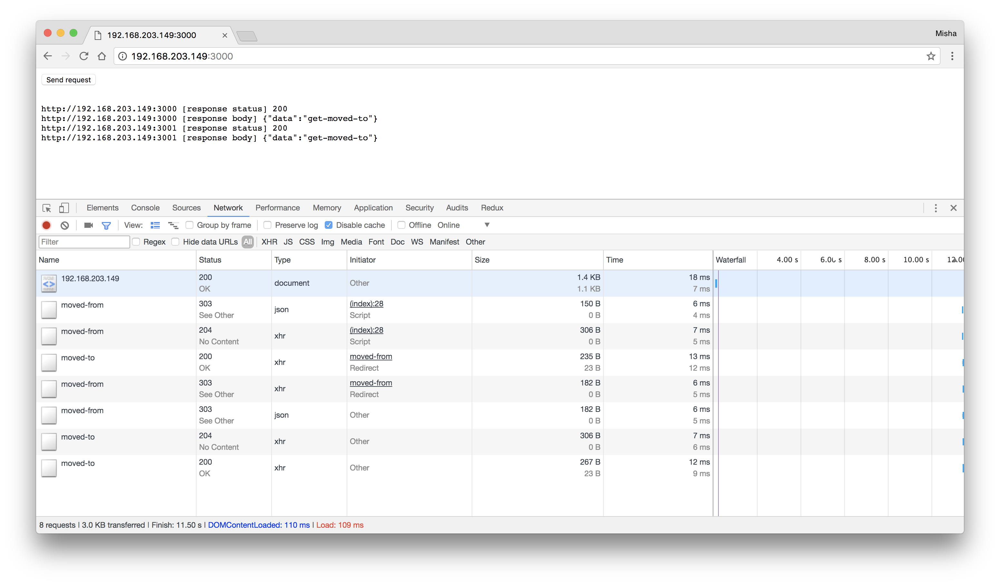
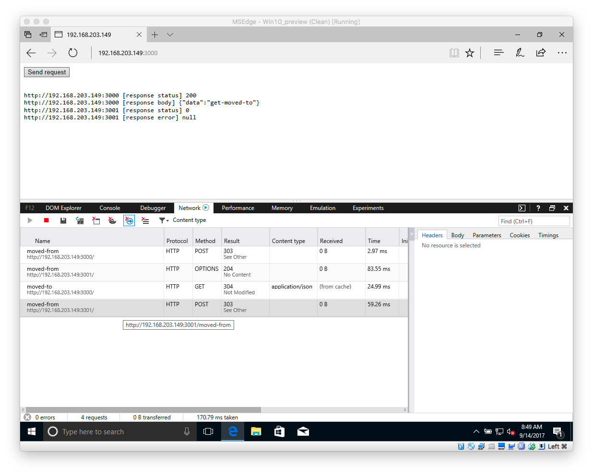

MS Edge CORS Redirect Issue
---------------------------

This repo provides a test case to show MS Edge not following a 303 redirect when requesting across origins.

    $ npm install
    $ node server-3000.js
    $ node server-3001.js
    $ // Open http://localhost:3000 in MS Edge

### Chrome

### MS Edge

